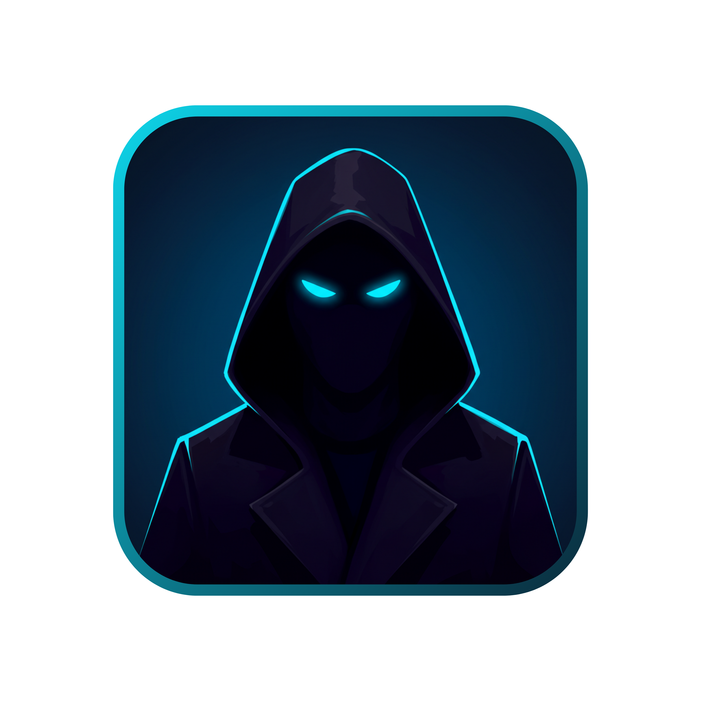
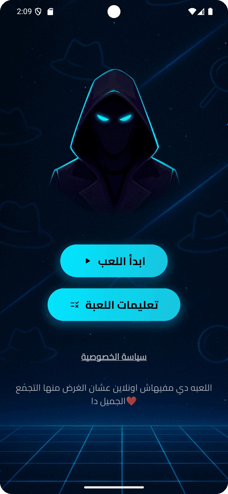

<p align="center">
  
</p>

<h1 align="center">مين الجاسوس؟ – Min el Gasos</h1>
<p align="center">
  <em>A spy-guessing party game – 100 % offline & Arabic-first 🇪🇬</em>
</p>

<p align="center">
  <a href="https://play.google.com/store/apps/details?id=com.sherifmadkor.minelgasos">
    
  </a>
</p>

<p align="center">
  <a href="https://img.shields.io/badge/Flutter-3.22-blue?logo=flutter"></a>
  <a href="https://img.shields.io/badge/Platform-Android%20%7C%20iOS-success"></a>
  <a href="LICENSE"></a>
</p>

---



## ✨ Features
| Screen | Highlights |
|--------|------------|
| **Home** | Sleek Arabic UI, black theme |
| **Player Setup** | Dynamic player count, emoji avatars |
| **Spy Reveal** | Secure per-player reveal, secret location |
| **Timer** | Crisp countdown, alarm sound |
| **Ads** | AdMob banner + interstitial (privacy-compliant) |

## 📐 Architecture
```txt
lib/
 ├─ core/            # theme, constants
 ├─ screens/
 │   ├─ first_screen.dart
 │   ├─ second_screen.dart
 │   ├─ role_reveal_screen.dart
 │   └─ game_timer_screen.dart
 └─ widgets/         # reusable UI atoms
